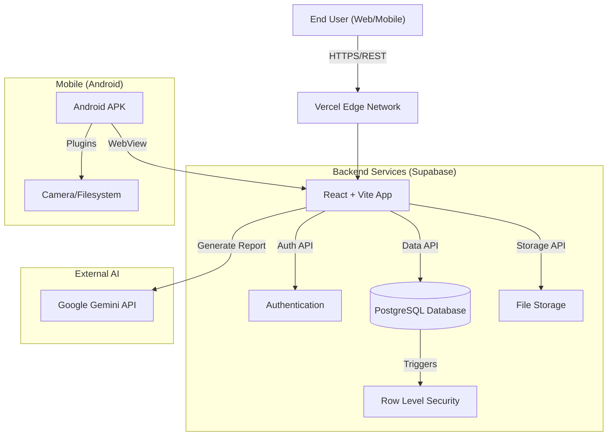

# 🌐 ClubSphere - Advanced Campus Management System


**ClubSphere** is a next-generation, full-stack platform designed to digitize and streamline the entire ecosystem of college clubs. From creating events and managing budgets to AI-powered reporting and real-time approvals, ClubSphere connects Students, Club Administrators, and University Deans in a unified, transparent interface.

---

## 🚀 Key Highlights

*   **📱 Native Mobile Experience**: Built with **Capacitor**, offering a native Android app experience with safe-area handling and touch-optimized UI.
*   **🤖 AI-Driven Insights**: Integrated with **Google Gemini AI** to auto-generate event impact reports and analyze budget proposals.
*   **🔐 Enterprise-Grade Security**: Row Level Security (RLS) via Supabase ensures data isolation between roles (Student vs. Dean).
*   **📡 Offline-First PWA**: Functions seamlessly as a Progressive Web App, completely installable on iOS and Desktop.
*   **📊 Dynamic Form Builder**: A built-in drag-and-drop form creator (like Google Forms) for event registrations and feedback.

---

## 🏗️ System Architecture

ClubSphere follows a modern **Serverless** architecture, leveraging Supabase for the backend infrastructure and React for the client-side experience.



---

## 🛠️ Technology Stack

### **Frontend & Mobile Client**
*   **Core Framework**: [React 18](https://react.dev/) + [TypeScript](https://www.typescriptlang.org/)
*   **Build Tool**: [Vite](https://vitejs.dev/) (Super fast HMR)
*   **Mobile Wrapper**: [Capacitor 6](https://capacitorjs.com/) (Android Target: SDK 34)
*   **State Management**: [Zustand](https://github.com/pmndrs/zustand) (Simpler than Redux)
*   **Routing**: [React Router DOM v6](https://reactrouter.com/)

### **UI & Experience**
*   **Styling Engine**: [Tailwind CSS](https://tailwindcss.com/)
*   **Animations**: [Framer Motion](https://www.framer.com/motion/) (Complex transitions)
*   **Icons**: [Lucide React](https://lucide.dev/)
*   **Data Visualization**: [Recharts](https://recharts.org/)
*   **Notifications**: [Sonner](https://sonner.emilkowal.ski/)
*   **Drag & Drop**: [dnd-kit](https://dndkit.com/)

### **Backend & Infrastructure**
*   **Database**: PostgreSQL (hosted on Supabase)
*   **Auth**: Supabase Auth (JWT based)
*   **Storage**: Supabase Storage Buckets (Images, Documents)
*   **Edge Functions**: Supabase Functions (Optional for complex logic)

### **AI & ML**
*   **LLM**: Google Gemini 1.5 Flash (Text generation for reports)

---

## 💾 Database Schema Overview

The application relies on a robust relational schema. Key tables include:

| Table Name | Description | Key Relationships |
| :--- | :--- | :--- |
| `profiles` | Stores user details (Role, Full Name, Avatar). | Linked to `auth.users` |
| `clubs` | Club Metadata (Name, Description, Logo). | Managed by `profiles` (Admins) |
| `events` | Event data (Date, Venue, Budget). | Belongs to `clubs` |
| `proposals` | Budget/Event proposals sent to Dean. | Linked to `events` |
| `forms` | Custom forms created by clubs. | Belongs to `clubs` |
| `form_responses` | Submissions for forms. | Linked to `forms` |

---

## ⚡ Setup Guide

### 1. Prerequisites
*   **Node.js**: v18.0.0 or higher
*   **npm**: v9.0.0 or higher
*   **Android Studio**: (Only if building the APK)

### 2. Environment Variables
Create a `.env` file in the root directory. **CRITICAL**: Do not commit this file.

```env
# Connects to your Supabase Project
VITE_SUPABASE_URL=https://your-project.supabase.co
VITE_SUPABASE_ANON_KEY=your-public-anon-key

# Powered by Google AI Studio
VITE_GEMINI_API_KEY=your-gemini-api-key
```

### 3. Installation

**Web Development:**
```bash
# Clone Repo
git clone https://github.com/Ashwinjauhary/ClubSphere.git
cd ClubSphere

# Install Dependencies
npm install

# Start Local Server
npm run dev
```

**Android Development:**
```bash
# Sync web code to native android project
npx cap sync

# Open Android Studio
npx cap open android
```

---

## 🔄 User Workflows

### **1. The Event Approval Flow**
1.  **Club Admin** creates an Event Proposal (Budget, Venue, Date).
2.  Proposal status set to `PENDING`.
3.  **Dean** receives a real-time notification.
4.  **Dean** reviews the proposal.
    *   *Approve*: Event becomes public for students.
    *   *Reject*: Admin notified with reason.

### **2. The AI Reporting Flow**
1.  **Club Admin** goes to "Reports" tab after an event.
2.  Clicks "Generate with AI".
3.  System sends event statistics (Attendees, Budget Used) to Gemini.
4.  **Gemini** generates a summarized Impact Report & Future Suggestions.
5.  Report is saved to Database/PDF.

---

## 🐛 Troubleshooting

*   **"AuthApiError: Invalid Refresh Token"**:
    *   *Cause*: Local storage session is out of sync with server.
    *   *Fix*: Clear Application Storage (DevTools > Application > Local Storage) and log in again.
*   **Mobile Header Overlap**:
    *   *Fix*: Ensure you are pulling the latest `main` branch. We recently implemented `safe-area-inset` support for notched devices.
*   **Build Failures (Vite)**:
    *   *Fix*: Run `npm run build` locally to check for TypeScript errors before pushing.

---

## 🤝 Contributing

We welcome contributions!
1.  Fork the repo.
2.  Create a feature branch (`git checkout -b feature/AmazingFeature`).
3.  Commit your changes.
4.  Open a Pull Request.

---

## 📜 License

This project is licensed under the MIT License.

---

**Developed with ❤️ by Ashwin Jauhary for Campus Communities.**
